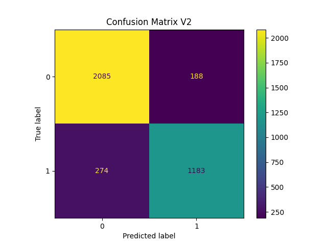
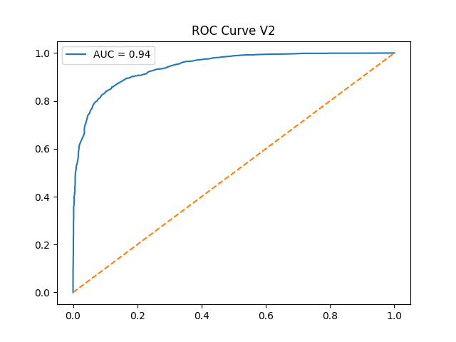
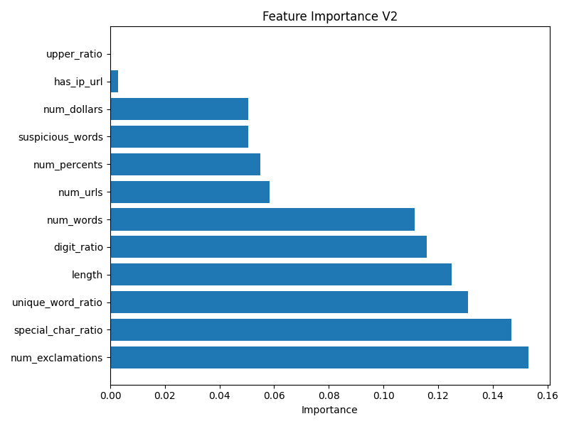
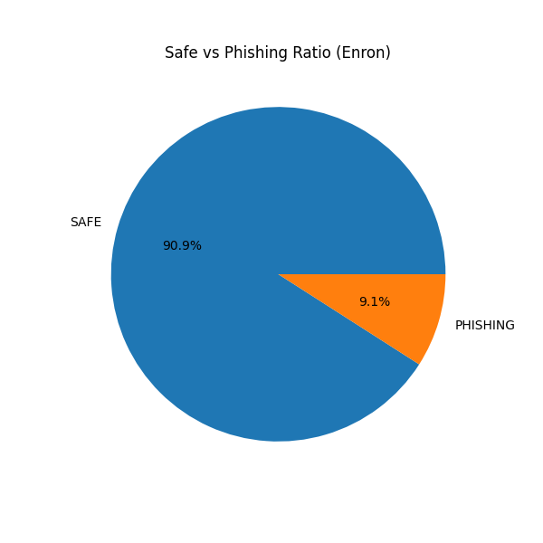

# 🛡️ Phishing Guardian — Explainable AI Phishing Detection Platform


---

## Overview

**Phishing Guardian** is a machine learning–based phishing detection system designed to classify emails as **SAFE** or **PHISHING** while providing **Explainable AI (XAI)** insights for every prediction.

The project combines traditional ML techniques with modern explainability methods and a **Streamlit-based research dashboard** to support:

- Single email analysis  
- Model performance comparison  
- Explainable feature attribution  
- Real-world dataset evaluation (Enron)  
- CSV-based forensic inspection  

Unlike black-box classifiers, **Phishing Guardian exposes feature-level reasoning**, making it suitable as a **decision-support system** for cybersecurity research and operational environments.

This project was developed as a **Computer Engineering graduation project** with emphasis on **real-world applicability and transparency.**

---

## Features

- Random Forest phishing classifier  
- Two-stage model development (V1 baseline → V2 optimized)  
- Extended feature engineering (URLs, punctuation, urgency, structure, etc.)  
- Class weighting for imbalanced datasets  
- Explainable AI using SHAP-style feature contribution  
- Interactive Streamlit dashboard  
- Real-world validation on Enron Email Dataset  
- CSV export for predictions and XAI reports  
- Risk-score based triage analysis  

Dashboard modules include:

- Email Testing  
- Model Comparison (V1 vs V2)  
- Explainable AI Visualization  
- Enron Dataset Analysis  
- Dataset & CSV Exploration  

---

## Tech Stack

| Layer | Technologies |
|------|-------------|
| Frontend | Streamlit |
| Machine Learning | Scikit-learn (Random Forest) |
| Data Processing | Pandas, NumPy |
| Explainability | SHAP-style feature attribution |
| Visualization | Matplotlib, Streamlit UI |
| Language | Python |
| Version Control | Git, GitHub |

---

## System Architecture

Email Input  
↓  
Feature Extraction  
↓  
Random Forest Classification  
↓  
Explainable AI (Feature Impacts)  
↓  
Interactive Streamlit Dashboard  

---

## Model Versions

### V1 (Baseline)

- Base feature set  
- Accuracy: ~74%  
- Phishing Recall: ~64%  

### V2 (Optimized)

- Extended features  
- Class weighting  
- Accuracy: ~88%  
- Phishing Recall: ~81%  

V2 significantly reduces false negatives while improving overall stability.

---

## Explainable AI

Each prediction includes:

- SAFE-supporting features  
- PHISHING-pushing features  
- Risk score  
- Feature impact visualization  

Positive values push toward PHISHING, negative values toward SAFE.

This transforms the system into a **Decision Support System (DSS)** rather than a black-box filter.

---

## Real-World Evaluation

The optimized model was evaluated on the **Enron email corpus**.

Outputs include:

- SAFE vs PHISHING distribution  
- Risk score histogram  
- High-risk email ratios  
- Top risky emails  
- XAI reports per email  

These results demonstrate strong generalization beyond synthetic datasets.

---

## Installation (Development)

```bash
# Clone repository
git clone https://github.com/YOUR_USERNAME/phishing-guardian
cd phishing-guardian

# Create virtual environment
python -m venv venv
source venv/bin/activate   # Windows: venv\Scripts\activate

# Install dependencies
pip install -r requirements.txt

# Run Streamlit app
streamlit run app.py

``` 


## 📁 Important Note About Datasets

For privacy and size reasons, the following files are **NOT included** in this repository:

❌ Enron emails  
❌ Large prediction CSV files  
❌ Trained model binaries (`.joblib`)  

The repository **does include**:

✅ Full source code  
✅ Small labeled training datasets  
✅ Generated PNG visualizations  
✅ Configuration files  

To fully reproduce the results locally:

1. Download the Enron Email Dataset externally  
2. Place it under: data/enron/
3. Run the prediction and analysis scripts  

Once outputs are generated, the Streamlit dashboard automatically loads all results.


## 🖼️ Screenshots

```markdown







``` 

## 📌 About

-Phishing Guardian was developed as an academic research project focusing on:
-Practical phishing detection
-Explainable machine learning (XAI)
-Real-world dataset validation
-Interactive cybersecurity tooling

The system demonstrates how traditional machine learning models can be combined with explainability techniques and dashboards to produce transparent, operationally useful security tools.

## 🔐 Repository Access

Large datasets and trained models are intentionally excluded.

If you are reviewing this project for academic or technical evaluation,
please contact me directly for access instructions.
---


